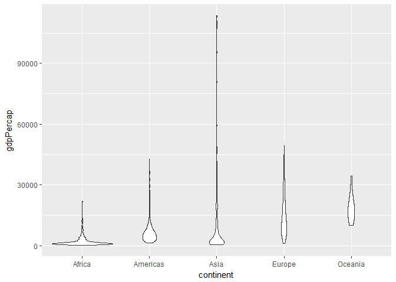

hw02-gapminder
================

Exploration of the gapminder data set
=====================================

1. Initialize the data
----------------------

-   Load the gapminder and tidyverse libraries:

``` r
library(gapminder)
library(tidyverse)
```

    ## -- Attaching packages ---------------------------------------------------------------------------------------------------------- tidyverse 1.2.1 --

    ## v ggplot2 2.2.1     v purrr   0.2.5
    ## v tibble  1.4.2     v dplyr   0.7.4
    ## v tidyr   0.8.1     v stringr 1.3.0
    ## v readr   1.1.1     v forcats 0.3.0

    ## -- Conflicts ------------------------------------------------------------------------------------------------------------- tidyverse_conflicts() --
    ## x dplyr::filter() masks stats::filter()
    ## x dplyr::lag()    masks stats::lag()

2. Explore the data
-------------------

-   Scope the data types and sizes:

``` r
(typeof(gapminder))
```

    ## [1] "list"

``` r
(str(gapminder))
```

    ## Classes 'tbl_df', 'tbl' and 'data.frame':    1704 obs. of  6 variables:
    ##  $ country  : Factor w/ 142 levels "Afghanistan",..: 1 1 1 1 1 1 1 1 1 1 ...
    ##  $ continent: Factor w/ 5 levels "Africa","Americas",..: 3 3 3 3 3 3 3 3 3 3 ...
    ##  $ year     : int  1952 1957 1962 1967 1972 1977 1982 1987 1992 1997 ...
    ##  $ lifeExp  : num  28.8 30.3 32 34 36.1 ...
    ##  $ pop      : int  8425333 9240934 10267083 11537966 13079460 14880372 12881816 13867957 16317921 22227415 ...
    ##  $ gdpPercap: num  779 821 853 836 740 ...

    ## NULL

``` r
class(gapminder)
```

    ## [1] "tbl_df"     "tbl"        "data.frame"

``` r
nrow(gapminder)
```

    ## [1] 1704

``` r
ncol(gapminder)
```

    ## [1] 6

``` r
length(gapminder)
```

    ## [1] 6

``` r
head(gapminder)
```

    ## # A tibble: 6 x 6
    ##   country     continent  year lifeExp      pop gdpPercap
    ##   <fct>       <fct>     <int>   <dbl>    <int>     <dbl>
    ## 1 Afghanistan Asia       1952    28.8  8425333      779.
    ## 2 Afghanistan Asia       1957    30.3  9240934      821.
    ## 3 Afghanistan Asia       1962    32.0 10267083      853.
    ## 4 Afghanistan Asia       1967    34.0 11537966      836.
    ## 5 Afghanistan Asia       1972    36.1 13079460      740.
    ## 6 Afghanistan Asia       1977    38.4 14880372      786.

``` r
summary(gapminder)
```

    ##         country        continent        year         lifeExp     
    ##  Afghanistan:  12   Africa  :624   Min.   :1952   Min.   :23.60  
    ##  Albania    :  12   Americas:300   1st Qu.:1966   1st Qu.:48.20  
    ##  Algeria    :  12   Asia    :396   Median :1980   Median :60.71  
    ##  Angola     :  12   Europe  :360   Mean   :1980   Mean   :59.47  
    ##  Argentina  :  12   Oceania : 24   3rd Qu.:1993   3rd Qu.:70.85  
    ##  Australia  :  12                  Max.   :2007   Max.   :82.60  
    ##  (Other)    :1632                                                
    ##       pop              gdpPercap       
    ##  Min.   :6.001e+04   Min.   :   241.2  
    ##  1st Qu.:2.794e+06   1st Qu.:  1202.1  
    ##  Median :7.024e+06   Median :  3531.8  
    ##  Mean   :2.960e+07   Mean   :  7215.3  
    ##  3rd Qu.:1.959e+07   3rd Qu.:  9325.5  
    ##  Max.   :1.319e+09   Max.   :113523.1  
    ## 

Conclusions:
------------

-   Type: list (using typeof())
-   Rows:1704; Columns:\`r ncol(gapminder)
-   Gapminder contains the classes: tbl\_df (i.e. tibble), tbl (i.e. table) and df (i.e. data frame)
-   Variable types:

| **Variable** | **Type**              |
|--------------|-----------------------|
| country      | factor w/ 142 levels: |
| continent    | factor w/ 5 levels    |
| year         | int                   |
| lifeExp      | num                   |
| pop          | int                   |
| gpdPercap    | num                   |

-   There are multiple ways to determine the size and extent of data (e.g. str, typeof, head, summary). Multiple ways assessing the data can be useful for error checking based on expected redundancies (e.g. str() provides information that is redundant with the information obtained from ncol() and nrow())

-   The categorical variable *continent* and the quantitative variable *gdpPercap* are selected. The range of each is determined below:

``` r
(range(gapminder$gdpPercap))
```

    ## [1]    241.1659 113523.1329

``` r
(levels(gapminder$continent))
```

    ## [1] "Africa"   "Americas" "Asia"     "Europe"   "Oceania"

-   The spread and distribution of *gdpPercap* is explored below:

``` r
gdp <- select(gapminder, gdpPercap)
(n <- nrow(gdp))
```

    ## [1] 1704

``` r
(mu <- sum(gdp)/n)
```

    ## [1] 7215.327

``` r
(diffs <- gdp - mu)
```

    ##          gdpPercap
    ## 1     -6435.881767
    ## 2     -6394.474052
    ## 3     -6362.226371
    ## 4     -6379.129943
    ## 5     -6475.345975
    ## 6     -6429.213721
    ## 7     -6237.315642
    ## 8     -6362.931136
    ## 9     -6565.985686
    ## 10    -6579.985730
    ## 11    -6488.593026
    ## 12    -6240.746743
    ## 13    -5614.270945
    ## 14    -5273.042837
    ## 15    -4902.438123
    ## 16    -4455.130150
    ## 17    -3901.904893
    ## 18    -3682.323171
    ## 19    -3584.446359
    ## 20    -3476.394346
    ## 21    -4717.889180
    ## 22    -4022.272477
    ## 23    -2611.115344
    ## 24    -1278.297555
    ## 25    -4766.318896
    ## 26    -4201.351058
    ## 27    -4664.510201
    ## 28    -3968.335310
    ## 29    -3032.663315
    ## 30    -2304.910325
    ## 31    -1470.166868
    ## 32    -1533.968542
    ## 33    -2192.110434
    ## 34    -2418.032030
    ## 35    -1927.286699
    ## 36     -991.959616
    ## 37    -3694.716808
    ## 38    -3387.386616
    ## 39    -2946.050339
    ## 40    -1692.550706
    ## 41    -1742.039076
    ## 42    -4206.679726
    ## 43    -4458.373409
    ## 44    -4785.118770
    ## 45    -4587.481396
    ## 46    -4938.186197
    ## 47    -4442.039769
    ## 48    -2418.095814
    ## 49    -1304.012028
    ## 50     -358.470869
    ## 51      -82.161058
    ## 52      837.625940
    ## 53     2227.711445
    ## 54     2863.699659
    ## 55     1782.570331
    ## 56     1924.344308
    ## 57     2093.091629
    ## 58     3751.954869
    ## 59     1582.313635
    ## 60     5564.052559
    ## 61     2824.268559
    ## 62     3734.322509
    ## 63     5001.899779
    ## 64     7310.797569
    ## 65     9573.302399
    ## 66    11118.870429
    ## 67    12261.682199
    ## 68    14673.561949
    ## 69    16209.439749
    ## 70    19782.609489
    ## 71    23472.427649
    ## 72    27220.040359
    ## 73    -1078.250589
    ## 74     1627.270949
    ## 75     3535.394029
    ## 76     5619.275319
    ## 77     9446.298519
    ## 78    12534.095219
    ## 79    14381.756539
    ## 80    16472.498989
    ## 81    19826.691599
    ## 82    21880.593579
    ## 83    25202.280609
    ## 84    28911.165619
    ## 85     2651.757684
    ## 86     4420.472369
    ## 87     5537.948059
    ## 88     7589.345619
    ## 89    11053.331309
    ## 90    12124.774879
    ## 91    11995.820229
    ## 92    11308.696979
    ## 93    11820.252089
    ## 94    13076.689709
    ## 95    16188.232189
    ## 96    22580.721259
    ## 97    -6531.082910
    ## 98    -6553.689624
    ## 99    -6528.985527
    ## 100   -6494.140995
    ## 101   -6585.093455
    ## 102   -6555.449849
    ## 103   -6538.345216
    ## 104   -6463.347678
    ## 105   -6377.516917
    ## 106   -6242.557046
    ## 107   -6078.936651
    ## 108   -5824.073289
    ## 109    1127.778046
    ## 110    2499.633542
    ## 111    3775.879679
    ## 112    5933.714109
    ## 113    9456.816479
    ## 114   11902.647399
    ## 115   13764.518809
    ## 116   15310.235999
    ## 117   18360.243609
    ## 118   20345.869549
    ## 119   23270.556669
    ## 120   26477.277999
    ## 121   -6152.574881
    ## 122   -6255.726001
    ## 123   -6265.828017
    ## 124   -6179.495670
    ## 125   -6129.530202
    ## 126   -6186.165830
    ## 127   -5937.429465
    ## 128   -5989.471071
    ## 129   -6024.119400
    ## 130   -5982.351789
    ## 131   -5842.449150
    ## 132   -5774.042208
    ## 133   -4538.000734
    ## 134   -5087.640755
    ## 135   -5034.354535
    ## 136   -4628.441028
    ## 137   -4234.995742
    ## 138   -3667.229249
    ## 139   -4058.816629
    ## 140   -4461.635591
    ## 141   -4253.627387
    ## 142   -3889.183890
    ## 143   -3802.064391
    ## 144   -3393.189997
    ## 145   -6241.793886
    ## 146   -5861.337905
    ## 147   -5505.643402
    ## 148   -5042.974658
    ## 149   -4355.157331
    ## 150   -3686.845776
    ## 151   -3088.713924
    ## 152   -2901.212324
    ## 153   -4668.545636
    ## 154   -2448.971177
    ## 155   -1196.351842
    ## 156     230.971722
    ## 157   -6364.085941
    ## 158   -6297.094546
    ## 159   -6231.673105
    ## 160   -6000.617787
    ## 161   -4951.715967
    ## 162   -4000.469263
    ## 163   -2664.184931
    ## 164   -1009.443231
    ## 165     738.784564
    ## 166    1431.815232
    ## 167    3788.277999
    ## 168    5354.524689
    ## 169   -5106.382726
    ## 170   -4727.961092
    ## 171   -3878.741279
    ## 172   -3785.462724
    ## 173   -2229.615614
    ## 174    -555.208427
    ## 175    -184.491203
    ## 176     591.768737
    ## 177    -265.044060
    ## 178     742.653743
    ## 179     915.885762
    ## 180    1850.473744
    ## 181   -4771.040433
    ## 182   -4206.656354
    ## 183   -2960.989242
    ## 184   -1638.324281
    ## 185    -617.832683
    ## 186     396.913357
    ## 187    1008.864566
    ## 188    1024.527743
    ## 189    -912.703643
    ## 190   -1244.938321
    ## 191     481.450644
    ## 192    3465.465739
    ## 193   -6672.071840
    ## 194   -6598.143616
    ## 195   -6492.815061
    ## 196   -6420.500522
    ## 197   -6360.591105
    ## 198   -6471.940044
    ## 199   -6408.128496
    ## 200   -6303.263940
    ## 201   -6283.574308
    ## 202   -6269.032119
    ## 203   -6177.681860
    ## 204   -5998.294087
    ## 205   -6876.030623
    ## 206   -6835.762453
    ## 207   -6860.123854
    ## 208   -6802.349568
    ## 209   -6751.227577
    ## 210   -6659.223816
    ## 211   -6655.723850
    ## 212   -6593.508262
    ## 213   -6583.627203
    ## 214   -6752.211933
    ## 215   -6768.923569
    ## 216   -6785.256390
    ## 217   -6846.857796
    ## 218   -6781.288745
    ## 219   -6718.413434
    ## 220   -6691.894767
    ## 221   -6793.703056
    ## 222   -6690.354898
    ## 223   -6590.851603
    ## 224   -6531.431508
    ## 225   -6533.023906
    ## 226   -6481.041911
    ## 227   -6319.101066
    ## 228   -5501.548395
    ## 229   -6042.659426
    ## 230   -5902.278982
    ## 231   -5815.719640
    ## 232   -5706.873933
    ## 233   -5531.180553
    ## 234   -5431.894208
    ## 235   -4847.343799
    ## 236   -4612.662875
    ## 237   -5422.163803
    ## 238   -5520.989612
    ## 239   -5281.315632
    ## 240   -5173.231841
    ## 241    4151.834039
    ## 242    5274.622979
    ## 243    6247.158469
    ## 244    8861.260949
    ## 245   11755.243779
    ## 246   14875.555979
    ## 247   15683.465059
    ## 248   19411.187949
    ## 249   19127.557179
    ## 250   21739.598809
    ## 251   26113.637989
    ## 252   29103.907929
    ## 253   -6144.016368
    ## 254   -6024.482753
    ## 255   -6022.258328
    ## 256   -6079.270466
    ## 257   -6145.313806
    ## 258   -6105.952743
    ## 259   -6258.574091
    ## 260   -6370.450731
    ## 261   -6467.421556
    ## 262   -6474.820750
    ## 263   -6476.636474
    ## 264   -6509.310544
    ## 265   -6036.661154
    ## 266   -5906.831504
    ## 267   -5825.509463
    ## 268   -6018.516516
    ## 269   -6111.223094
    ## 270   -6081.342131
    ## 271   -6417.418981
    ## 272   -6262.940952
    ## 273   -6157.262781
    ## 274   -6210.365728
    ## 275   -6059.145221
    ## 276   -5511.263357
    ## 277   -3275.348292
    ## 278   -2899.704358
    ## 279   -2696.232750
    ## 280   -2108.672768
    ## 281   -1721.302644
    ## 282   -2458.563245
    ## 283   -2119.661343
    ## 284   -1668.263327
    ## 285     380.798883
    ## 286    2902.726099
    ## 287    3563.456769
    ## 288    5956.311769
    ## 289   -6814.878470
    ## 290   -6639.340080
    ## 291   -6727.653063
    ## 292   -6602.621388
    ## 293   -6538.426989
    ## 294   -6474.089611
    ## 295   -6252.905701
    ## 296   -5836.423063
    ## 297   -5559.542923
    ## 298   -4926.092945
    ## 299   -4096.046185
    ## 300   -2256.212227
    ## 301   -5071.211985
    ## 302   -4891.521500
    ## 303   -4722.975972
    ## 304   -4536.597242
    ## 305   -3950.667040
    ## 306   -3399.519211
    ## 307   -2817.751422
    ## 308   -2312.107981
    ## 309   -1770.678464
    ## 310   -1097.965335
    ## 311   -1460.067119
    ## 312    -208.746662
    ## 313   -6112.336145
    ## 314   -6004.178533
    ## 315   -5808.678803
    ## 316   -5339.297438
    ## 317   -5277.749406
    ## 318   -6042.724034
    ## 319   -5948.226998
    ## 320   -5899.346269
    ## 321   -5968.419711
    ## 322   -6041.708846
    ## 323   -6139.515523
    ## 324   -6229.179202
    ## 325   -6434.784756
    ## 326   -6309.466851
    ## 327   -6319.012448
    ## 328   -6353.733839
    ## 329   -6310.431013
    ## 330   -6419.569799
    ## 331   -6541.579263
    ## 332   -6542.552269
    ## 333   -6757.607901
    ## 334   -6903.138658
    ## 335   -6974.161205
    ## 336   -6937.775223
    ## 337   -5089.705663
    ## 338   -4900.270509
    ## 339   -4750.543924
    ## 340   -4537.387439
    ## 341   -4002.174398
    ## 342   -3956.148103
    ## 343   -2335.819559
    ## 344   -3014.132144
    ## 345   -3199.087552
    ## 346   -3731.162705
    ## 347   -3731.265111
    ## 348   -3582.769283
    ## 349   -4588.317610
    ## 350   -4225.316279
    ## 351   -3754.390056
    ## 352   -3053.599247
    ## 353   -2097.180142
    ## 354   -1288.450114
    ## 355   -1952.592330
    ## 356   -1585.411763
    ## 357   -1054.910764
    ## 358    -538.281767
    ## 359     508.120114
    ## 360    2429.734339
    ## 361   -5826.732349
    ## 362   -5714.431156
    ## 363   -5486.457653
    ## 364   -5163.276608
    ## 365   -4837.125970
    ## 366   -4697.590534
    ## 367   -4612.616912
    ## 368   -5058.371012
    ## 369   -5567.253290
    ## 370   -5429.061674
    ## 371   -5566.526258
    ## 372   -5670.576969
    ## 373   -4096.090561
    ## 374   -2877.095464
    ## 375   -1737.437063
    ## 376    -255.029220
    ## 377    1948.763046
    ## 378    4090.058089
    ## 379    6006.494759
    ## 380    6607.256859
    ## 381    1232.467792
    ## 382    2660.277434
    ## 383    4413.061869
    ## 384    7403.895639
    ## 385   -1628.788301
    ## 386   -1123.152722
    ## 387   -2034.571171
    ## 388   -1525.059066
    ## 389   -1909.881825
    ## 390    -834.832115
    ## 391     101.591026
    ## 392     317.597682
    ## 393   -1622.483118
    ## 394   -1783.336666
    ## 395    -874.680398
    ## 396    1732.775842
    ## 397    -339.186831
    ## 398    1041.016837
    ## 399    2921.540049
    ## 400    4184.117809
    ## 401    5893.126519
    ## 402    7584.833539
    ## 403    8161.901469
    ## 404    9095.116319
    ## 405    7081.694139
    ## 406    8833.187159
    ## 407   10380.883139
    ## 408   15617.981429
    ## 409    2477.058164
    ## 410    3884.332269
    ## 411    6367.986429
    ## 412    8721.884149
    ## 413   11650.880129
    ## 414   13207.574419
    ## 415   14472.713399
    ## 416   17900.848729
    ## 417   19191.412769
    ## 418   22589.018589
    ## 419   24951.172979
    ## 420   28063.091659
    ## 421   -4545.797606
    ## 422   -4350.358005
    ## 423   -4194.337818
    ## 424   -4195.276568
    ## 425   -3521.114729
    ## 426   -4133.566059
    ## 427   -4335.859014
    ## 428   -4335.224513
    ## 429   -4838.170889
    ## 430   -5320.310097
    ## 431   -5307.066214
    ## 432   -5132.845514
    ## 433   -5817.609944
    ## 434   -5670.924086
    ## 435   -5553.189722
    ## 436   -5561.604078
    ## 437   -5025.452582
    ## 438   -4533.338181
    ## 439   -4354.234695
    ## 440   -4315.484906
    ## 441   -4171.112867
    ## 442   -3601.225796
    ## 443   -2651.518927
    ## 444   -1189.952329
    ## 445   -3693.216364
    ## 446   -3434.780430
    ## 447   -3129.213003
    ## 448   -2636.252866
    ## 449   -1934.332371
    ## 450    -535.703821
    ## 451      -1.535814
    ## 452    -733.550088
    ## 453    -111.624486
    ## 454     214.128796
    ## 455   -1442.282569
    ## 456    -342.064755
    ## 457   -5796.504636
    ## 458   -5756.411809
    ## 459   -5521.991228
    ## 460   -5400.446353
    ## 461   -5191.318934
    ## 462   -4429.833499
    ## 463   -3711.597445
    ## 464   -3329.866371
    ## 465   -3420.571886
    ## 466   -3042.145284
    ## 467   -2460.722667
    ## 468   -1634.146083
    ## 469   -4167.024181
    ## 470   -3793.803863
    ## 471   -3438.523454
    ## 472   -2856.731688
    ## 473   -2695.081073
    ## 474   -2076.404707
    ## 475   -3116.982906
    ## 476   -3074.884984
    ## 477   -2771.095381
    ## 478   -2060.501585
    ## 479   -1863.758415
    ## 480   -1486.973567
    ## 481   -6839.683958
    ## 482   -6789.230673
    ## 483   -6632.485110
    ## 484   -6299.731079
    ## 485   -6542.914824
    ## 486   -6256.760269
    ## 487   -6287.501739
    ## 488   -6248.430266
    ## 489   -6083.272047
    ## 490   -4400.846326
    ## 491     488.168819
    ## 492    4938.762669
    ## 493   -6886.386524
    ## 494   -6871.165195
    ## 495   -6834.331238
    ## 496   -6746.532111
    ## 497   -6701.002873
    ## 498   -6709.573274
    ## 499   -6690.451232
    ## 500   -6694.192948
    ## 501   -6632.468571
    ## 502   -6301.856291
    ## 503   -6449.977080
    ## 504   -6573.957558
    ## 505   -6853.180802
    ## 506   -6836.422918
    ## 507   -6795.870665
    ## 508   -6699.208437
    ## 509   -6649.083137
    ## 510   -6658.518698
    ## 511   -6637.466334
    ## 512   -6641.585767
    ## 513   -6793.973616
    ## 514   -6699.437680
    ## 515   -6685.273549
    ## 516   -6524.521505
    ## 517    -790.808010
    ## 518     330.088305
    ## 519    2156.515480
    ## 520    3706.309179
    ## 521    7143.548819
    ## 522    8390.095749
    ## 523   11317.830529
    ## 524   13925.685149
    ## 525   13431.837909
    ## 526   16508.623119
    ## 527   20989.263489
    ## 528   25991.757319
    ## 529    -185.517754
    ## 530    1447.507817
    ## 531    3345.158449
    ## 532    5784.590579
    ## 533    8891.864629
    ## 534   11077.308059
    ## 535   13078.570379
    ## 536   14851.115059
    ## 537   17488.469069
    ## 538   18674.457789
    ## 539   21710.705259
    ## 540   23254.689619
    ## 541   -2921.850606
    ## 542   -2239.128982
    ## 543    -583.867859
    ## 544    1143.434906
    ## 545    4186.621329
    ## 546   14530.246199
    ## 547    7898.034859
    ## 548    4649.081359
    ## 549    6306.830439
    ## 550    7507.514799
    ## 551    5306.386839
    ## 552    5991.157439
    ## 553   -6730.096422
    ## 554   -6694.400370
    ## 555   -6615.676805
    ## 556   -6480.544169
    ## 557   -6459.240245
    ## 558   -6330.571831
    ## 559   -6379.517470
    ## 560   -6603.668220
    ## 561   -6549.702669
    ## 562   -6561.596911
    ## 563   -6554.741482
    ## 564   -6462.577355
    ## 565     -71.212688
    ## 566    2972.499569
    ## 567    5687.135829
    ## 568    7530.298529
    ## 569   10800.853189
    ## 570   13297.594149
    ## 571   14816.205659
    ## 572   17423.858579
    ## 573   19289.976089
    ## 574   20573.557079
    ## 575   22820.474899
    ## 576   24955.047339
    ## 577   -6304.028144
    ## 578   -6171.765544
    ## 579   -6025.285963
    ## 580   -6089.629921
    ## 581   -6037.103373
    ## 582   -6222.103124
    ## 583   -6339.294512
    ## 584   -6368.320968
    ## 585   -6290.266927
    ## 586   -6210.081269
    ## 587   -6103.342503
    ## 588   -5887.718171
    ## 589   -3684.637014
    ## 590   -2299.027192
    ## 591   -1198.136348
    ## 592    1297.769935
    ## 593    5509.502489
    ## 594    6980.197199
    ## 595    8053.093809
    ## 596    8905.201309
    ## 597   10326.169259
    ## 598   11532.371059
    ## 599   15298.927719
    ## 600   20323.084799
    ## 601   -4787.089312
    ## 602   -4598.171114
    ## 603   -4464.962635
    ## 604   -3972.795934
    ## 605   -3183.918810
    ## 606   -2335.334333
    ## 607   -2394.832291
    ## 608   -2968.841107
    ## 609   -2775.876241
    ## 610   -2531.013274
    ## 611   -2356.979586
    ## 612   -2029.277078
    ## 613   -6705.130589
    ## 614   -6639.060057
    ## 615   -6528.953407
    ## 616   -6506.567540
    ## 617   -6473.660851
    ## 618   -6340.641217
    ## 619   -6358.076724
    ## 620   -6409.754609
    ## 621   -6420.978643
    ## 622   -6345.877314
    ## 623   -6269.743498
    ## 624   -6272.672870
    ## 625   -6915.476762
    ## 626   -6783.536625
    ## 627   -6693.292709
    ## 628   -6499.746441
    ## 629   -6395.102494
    ## 630   -6450.601118
    ## 631   -6377.203114
    ## 632   -6478.911689
    ## 633   -6469.787211
    ## 634   -6418.662613
    ## 635   -6639.622364
    ## 636   -6636.095338
    ## 637   -5374.960142
    ## 638   -5488.439199
    ## 639   -5418.738049
    ## 640   -5763.269415
    ## 641   -5560.870135
    ## 642   -5341.028150
    ## 643   -5204.167532
    ## 644   -5392.311086
    ## 645   -5759.017564
    ## 646   -5873.600150
    ## 647   -5944.962149
    ## 648   -6013.689927
    ## 649   -5020.400877
    ## 650   -4994.839399
    ## 651   -4924.170246
    ## 652   -4677.057723
    ## 653   -4685.484736
    ## 654   -4012.119015
    ## 655   -4093.566287
    ## 656   -4192.230382
    ## 657   -4133.632478
    ## 658   -4054.872175
    ## 659   -4115.598421
    ## 660   -3666.996235
    ## 661   -4160.905872
    ## 662   -3586.250624
    ## 663   -2522.678809
    ## 664   -1017.364267
    ## 665    1100.601064
    ## 666    3970.814169
    ## 667    7345.203429
    ## 668   12823.145609
    ## 669   17542.275929
    ## 670   21162.305109
    ## 671   22993.688079
    ## 672   32509.651589
    ## 673   -1951.653265
    ## 674   -1175.147070
    ## 675     335.032796
    ## 676    2111.317589
    ## 677    2953.329029
    ## 678    4459.510289
    ## 679    5330.663579
    ## 680    5771.152899
    ## 681    3320.301469
    ## 682    4497.449719
    ## 683    7628.608479
    ## 684   10793.617359
    ## 685      52.361347
    ## 686    2028.674331
    ## 687    3134.831979
    ## 688    6104.568599
    ## 689    8582.736539
    ## 690   12439.635389
    ## 691   16054.280419
    ## 692   19707.879199
    ## 693   17929.064929
    ## 694   20845.772579
    ## 695   23947.874879
    ## 696   28965.462109
    ## 697   -6668.761332
    ## 698   -6625.265085
    ## 699   -6556.979930
    ## 700   -6514.556471
    ## 701   -6491.294554
    ## 702   -6401.989758
    ## 703   -6359.603544
    ## 704   -6238.814406
    ## 705   -6050.920272
    ## 706   -5756.509639
    ## 707   -5468.557627
    ## 708   -4763.116674
    ## 709   -6465.645427
    ## 710   -6356.426811
    ## 711   -6366.037311
    ## 712   -6452.895309
    ## 713   -6104.219174
    ## 714   -5832.625025
    ## 715   -5698.454093
    ## 716   -5466.970120
    ## 717   -4832.186183
    ## 718   -4095.991478
    ## 719   -4341.414211
    ## 720   -3674.675517
    ## 721   -4180.001079
    ## 722   -3925.069438
    ## 723   -3027.997279
    ## 724   -1308.595276
    ## 725    2398.491526
    ## 726    4673.267999
    ## 727     393.007521
    ## 728    -572.445710
    ## 729      20.326107
    ## 730    1048.263220
    ## 731    2025.434894
    ## 732    4390.387409
    ## 733   -3085.561025
    ## 734    -985.993519
    ## 735    1126.410734
    ## 736    1716.132730
    ## 737    2360.710515
    ## 738    7472.907989
    ## 739    7302.580029
    ## 740    4428.245599
    ## 741   -3469.686394
    ## 742   -4139.087286
    ## 743   -2824.609769
    ## 744   -2744.265175
    ## 745   -2005.046753
    ## 746   -1616.249209
    ## 747    -583.729767
    ## 748     440.241882
    ## 749    2315.445815
    ## 750    3935.654049
    ## 751    5402.994329
    ## 752    6657.539439
    ## 753   10343.488469
    ## 754   17306.620049
    ## 755   26861.722309
    ## 756   33460.669269
    ## 757   -3128.804953
    ## 758   -1830.048630
    ## 759    -109.696375
    ## 760    1178.414323
    ## 761    5571.605149
    ## 762    6091.292129
    ## 763    8151.702119
    ## 764    9907.152779
    ## 765   10836.195459
    ## 766   13681.282159
    ## 767   14690.268059
    ## 768   18307.950019
    ## 769   -2283.922926
    ## 770    -966.670849
    ## 771    1028.255259
    ## 772    2807.074229
    ## 773    5053.946699
    ## 774    7040.657669
    ## 775    9322.156419
    ## 776   11991.907739
    ## 777   14798.317779
    ## 778   17459.697379
    ## 779   20752.771089
    ## 780   21354.392619
    ## 781   -4316.796200
    ## 782   -2458.801300
    ## 783   -1969.219557
    ## 784   -1090.623630
    ## 785     218.562212
    ## 786    -565.131508
    ## 787   -1147.275731
    ## 788    -864.089586
    ## 789     189.596604
    ## 790     -93.402377
    ## 791    -220.552220
    ## 792     105.553181
    ## 793   -3998.370734
    ## 794   -2897.632716
    ## 795    -638.677620
    ## 796    2632.461526
    ## 797    7563.459279
    ## 798    9395.049929
    ## 799   12168.778629
    ## 800   15160.614809
    ## 801   19609.568029
    ## 802   21601.257909
    ## 803   21389.264819
    ## 804   24440.740979
    ## 805   -5668.419274
    ## 806   -5329.246490
    ## 807   -4867.317923
    ## 808   -4473.530829
    ## 809   -5104.470772
    ## 810   -4362.975513
    ## 811   -3053.911122
    ## 812   -2766.647169
    ## 813   -3783.733434
    ## 814   -3569.947509
    ## 815   -3370.409887
    ## 816   -2695.865910
    ## 817   -6361.786162
    ## 818   -6270.888766
    ## 819   -6318.360708
    ## 820   -6158.590624
    ## 821   -5992.967113
    ## 822   -5947.713877
    ## 823   -5867.101290
    ## 824   -5853.390225
    ## 825   -5873.405360
    ## 826   -5854.842060
    ## 827   -5927.812349
    ## 828   -5752.077799
    ## 829   -6127.049323
    ## 830   -5644.192426
    ## 831   -5593.633483
    ## 832   -5071.786472
    ## 833   -3513.705578
    ## 834   -3109.025832
    ## 835   -3108.801788
    ## 836   -3108.834766
    ## 837   -3489.263574
    ## 838   -5524.570267
    ## 839   -5568.568930
    ## 840   -5622.261601
    ## 841   -6184.734855
    ## 842   -5727.733544
    ## 843   -5678.982694
    ## 844   -5186.098939
    ## 845   -4184.450431
    ## 846   -2558.106061
    ## 847   -1592.384617
    ## 848    1317.761724
    ## 849    4888.951639
    ## 850    8778.200879
    ## 851   12018.661099
    ## 852   16132.812649
    ## 853  101167.025819
    ## 854  106307.805819
    ## 855   88242.784679
    ## 856   73679.556179
    ## 857  102132.539919
    ## 858   52050.150059
    ## 859   24138.708649
    ## 860   20903.102899
    ## 861   27717.592509
    ## 862   33085.292879
    ## 863   27894.778579
    ## 864   40091.662699
    ## 865   -2380.523014
    ## 866   -1125.540147
    ## 867   -1500.766470
    ## 868   -1208.344039
    ## 869     271.057260
    ## 870    1444.369755
    ## 871     425.192440
    ## 872   -1838.235752
    ## 873    -324.520227
    ## 874    1539.636769
    ## 875    2098.611749
    ## 876    3245.731599
    ## 877   -6916.480869
    ## 878   -6879.329966
    ## 879   -6803.526455
    ## 880   -6716.688055
    ## 881   -6718.745489
    ## 882   -6469.957540
    ## 883   -6418.063974
    ## 884   -6441.333867
    ## 885   -6237.840809
    ## 886   -6029.179087
    ## 887   -5940.142506
    ## 888   -5645.995639
    ## 889   -6639.754085
    ## 890   -6594.357091
    ## 891   -6581.131919
    ## 892   -6501.723433
    ## 893   -6412.321628
    ## 894   -6575.004643
    ## 895   -6643.127512
    ## 896   -6709.213224
    ## 897   -6578.704162
    ## 898   -6606.153130
    ## 899   -6683.844713
    ## 900   -6800.819740
    ## 901   -4827.779021
    ## 902   -3767.042686
    ## 903    -458.296265
    ## 904   11557.424609
    ## 905   13796.170129
    ## 906   14735.884679
    ## 907   10148.948299
    ## 908    4555.262719
    ## 909    2424.811420
    ## 910    2252.118975
    ## 911    2319.350386
    ## 912    4842.172199
    ## 913   -5772.315366
    ## 914   -5626.124331
    ## 915   -5571.939971
    ## 916   -5581.279799
    ## 917   -5466.764099
    ## 918   -5671.098495
    ## 919   -5912.448423
    ## 920   -6059.885133
    ## 921   -6174.650891
    ## 922   -6229.031186
    ## 923   -6320.689999
    ## 924   -6170.556955
    ## 925   -6846.162001
    ## 926   -6798.957275
    ## 927   -6787.425996
    ## 928   -6719.812301
    ## 929   -6630.705110
    ## 930   -6552.103405
    ## 931   -6582.523160
    ## 932   -6579.809718
    ## 933   -6652.127067
    ## 934   -6523.051271
    ## 935   -6549.903963
    ## 936   -6455.977171
    ## 937   -5384.194187
    ## 938   -5405.260089
    ## 939   -5178.442137
    ## 940   -4937.584685
    ## 941   -4366.232301
    ## 942   -3387.405510
    ## 943   -2294.971130
    ## 944   -1965.524428
    ## 945      62.585721
    ## 946    2917.582559
    ## 947    2991.650859
    ## 948    5236.328719
    ## 949   -6762.990101
    ## 950   -6724.944895
    ## 951   -6719.152738
    ## 952   -6670.317194
    ## 953   -6633.958205
    ## 954   -6528.931812
    ## 955   -6597.313017
    ## 956   -6531.155524
    ## 957   -6476.312706
    ## 958   -6425.069097
    ## 959   -6263.917329
    ## 960   -6172.745524
    ## 961   -6472.211172
    ## 962   -6369.206820
    ## 963   -6159.431045
    ## 964   -5794.181888
    ## 965   -5628.475300
    ## 966   -5717.834858
    ## 967   -5734.176892
    ## 968   -5793.723505
    ## 969   -5853.957297
    ## 970   -5732.190945
    ## 971   -5636.307538
    ## 972   -5412.175585
    ## 973   -5247.371374
    ## 974   -5181.289100
    ## 975   -4686.259594
    ## 976   -4739.939519
    ## 977   -4639.842923
    ## 978   -3504.344118
    ## 979   -3527.289342
    ## 980   -2431.740178
    ## 981   -1157.073235
    ## 982     210.378214
    ## 983    1806.488813
    ## 984    3741.664039
    ## 985   -3737.201552
    ## 986   -3083.780440
    ## 987   -2633.717696
    ## 988   -1460.593198
    ## 989    -405.920391
    ## 990     459.602027
    ## 991    2395.820460
    ## 992    1472.828922
    ## 993    2257.057214
    ## 994    2551.970449
    ## 995    3527.113449
    ## 996    4762.247879
    ## 997   -6428.760224
    ## 998   -6302.664473
    ## 999   -6158.973123
    ## 1000  -5989.285951
    ## 1001  -5793.585106
    ## 1002  -5567.815416
    ## 1003  -5214.723942
    ## 1004  -4877.318777
    ## 1005  -5429.925065
    ## 1006  -5313.074981
    ## 1007  -5074.587758
    ## 1008  -4119.554810
    ## 1009  -4567.741480
    ## 1010  -3533.067178
    ## 1011  -2565.733296
    ## 1012  -1307.476144
    ## 1013    563.086936
    ## 1014   2380.602824
    ## 1015   4007.260539
    ## 1016   4517.183089
    ## 1017   -211.988044
    ## 1018   -749.713732
    ## 1019   -658.132799
    ## 1020   2038.569030
    ## 1021  -5527.123511
    ## 1022  -5573.324767
    ## 1023  -5648.973588
    ## 1024  -5504.282311
    ## 1025  -5285.132106
    ## 1026  -4844.707105
    ## 1027  -4512.706725
    ## 1028  -4460.280090
    ## 1029  -4267.279829
    ## 1030  -4233.225223
    ## 1031  -3956.831497
    ## 1032  -3395.151851
    ## 1033  -6746.801043
    ## 1034  -6719.740248
    ## 1035  -6658.640727
    ## 1036  -6648.657927
    ## 1037  -6490.409278
    ## 1038  -6713.007348
    ## 1039  -6753.115666
    ## 1040  -6825.450897
    ## 1041  -6804.430257
    ## 1042  -6742.981004
    ## 1043  -6581.709135
    ## 1044  -6391.641461
    ## 1045  -6884.327081
    ## 1046  -6865.327081
    ## 1047  -6827.327081
    ## 1048  -6866.327081
    ## 1049  -6858.327081
    ## 1050  -6844.327081
    ## 1051  -6791.327081
    ## 1052  -6830.327081
    ## 1053  -6868.327081
    ## 1054  -6800.327081
    ## 1055  -6604.327081
    ## 1056  -6271.327081
    ## 1057  -4791.546638
    ## 1058  -4593.879023
    ## 1059  -4042.111486
    ## 1060  -3421.632328
    ## 1061  -3469.246133
    ## 1062  -3338.841123
    ## 1063  -3024.226570
    ## 1064  -3521.595744
    ## 1065  -3410.789082
    ## 1066  -3315.802821
    ## 1067  -3143.002330
    ## 1068  -2404.266652
    ## 1069  -6669.461358
    ## 1070  -6617.390725
    ## 1071  -6562.930222
    ## 1072  -6538.884856
    ## 1073  -6540.538952
    ## 1074  -6521.214641
    ## 1075  -6496.953987
    ## 1076  -6439.694631
    ## 1077  -6317.586721
    ## 1078  -6204.434943
    ## 1079  -6158.120770
    ## 1080  -6123.967303
    ## 1081   1726.244777
    ## 1082   4060.866359
    ## 1083   5575.522479
    ## 1084   8147.924279
    ## 1085  11579.418589
    ## 1086  13993.732119
    ## 1087  14184.133379
    ## 1088  16435.996529
    ## 1089  19575.622529
    ## 1090  23030.803549
    ## 1091  26509.430699
    ## 1092  29582.606239
    ## 1093   3341.248579
    ## 1094   5032.068239
    ## 1095   5960.350919
    ## 1096   7248.591849
    ## 1097   8830.710199
    ## 1098   9018.390619
    ## 1099  10417.083319
    ## 1100  11791.864209
    ## 1101  11147.997859
    ## 1102  13835.086689
    ## 1103  15974.474269
    ## 1104  17969.682029
    ## 1105  -4102.963133
    ## 1106  -3757.911134
    ## 1107  -3580.962675
    ## 1108  -2571.933547
    ## 1109  -2526.733814
    ## 1110  -1728.955992
    ## 1111  -3744.988925
    ## 1112  -4259.342706
    ## 1113  -5045.175357
    ## 1114  -4962.304077
    ## 1115  -4740.778262
    ## 1116  -4466.006116
    ## 1117  -6453.447705
    ## 1118  -6379.803679
    ## 1119  -6217.560969
    ## 1120  -6160.942190
    ## 1121  -6261.117845
    ## 1122  -6406.430008
    ## 1123  -6305.604946
    ## 1124  -6547.027058
    ## 1125  -6634.144356
    ## 1126  -6635.021872
    ## 1127  -6614.252580
    ## 1128  -6595.650189
    ## 1129  -6138.045225
    ## 1130  -6114.734518
    ## 1131  -6064.399603
    ## 1132  -6200.812977
    ## 1133  -5516.938243
    ## 1134  -5233.375275
    ## 1135  -5638.353331
    ## 1136  -5830.297518
    ## 1137  -5595.478864
    ## 1138  -5590.385806
    ## 1139  -5600.040686
    ## 1140  -5201.349776
    ## 1141   2880.094639
    ## 1142   4438.645959
    ## 1143   6235.074429
    ## 1144   9146.549389
    ## 1145  11749.728429
    ## 1146  16096.022309
    ## 1147  19083.308229
    ## 1148  24325.647719
    ## 1149  26750.334069
    ## 1150  34067.837249
    ## 1151  37468.648169
    ## 1152  42141.863089
    ## 1153  -5387.096774
    ## 1154  -4972.580530
    ## 1155  -4290.688968
    ## 1156  -2494.384394
    ## 1157   3402.711469
    ## 1158   4633.016839
    ## 1159   5739.463929
    ## 1160  10899.896049
    ## 1161  11401.379829
    ## 1162  12486.728729
    ## 1163  12559.509789
    ## 1164  15100.865789
    ## 1165  -6530.729937
    ## 1166  -6468.243552
    ## 1167  -6411.984339
    ## 1168  -6272.918822
    ## 1169  -6165.388100
    ## 1170  -6039.405888
    ## 1171  -5771.897249
    ## 1172  -5510.640498
    ## 1173  -5243.497617
    ## 1174  -5165.976560
    ## 1175  -5122.614640
    ## 1176  -4609.379501
    ## 1177  -4734.946747
    ## 1178  -4253.526176
    ## 1179  -3678.786780
    ## 1180  -2794.317997
    ## 1181  -1851.077418
    ## 1182  -1863.414937
    ## 1183   -205.725483
    ## 1184   -180.547920
    ## 1185   -596.584031
    ## 1186   -101.634829
    ## 1187    140.704853
    ## 1188   2593.858555
    ## 1189  -5263.018380
    ## 1190  -5169.172375
    ## 1191  -5067.299935
    ## 1192  -4915.950770
    ## 1193  -4691.989104
    ## 1194  -3966.953770
    ## 1195  -2956.823477
    ## 1196  -3216.451386
    ## 1197  -3018.916003
    ## 1198  -2967.926820
    ## 1199  -3431.652838
    ## 1200  -3042.488617
    ## 1201  -3456.803644
    ## 1202  -2970.070383
    ## 1203  -2258.289099
    ## 1204  -1427.233751
    ## 1205  -1277.499798
    ## 1206   -934.036226
    ## 1207   -780.825284
    ## 1208   -854.383637
    ## 1209  -2768.946157
    ## 1210  -1376.979424
    ## 1211  -1306.307008
    ## 1212    193.578480
    ## 1213  -5942.446086
    ## 1214  -5667.382237
    ## 1215  -5565.774928
    ## 1216  -5401.199651
    ## 1217  -5225.953011
    ## 1218  -4842.122794
    ## 1219  -4612.053316
    ## 1220  -5025.692086
    ## 1221  -4936.003064
    ## 1222  -4678.792156
    ## 1223  -4564.406013
    ## 1224  -4024.846065
    ## 1225  -3185.997382
    ## 1226  -2481.074062
    ## 1227  -1876.574938
    ## 1228   -658.174305
    ## 1229    791.179912
    ## 1230   2292.814373
    ## 1231   1236.203923
    ## 1232   1867.024091
    ## 1233    523.554166
    ## 1234   2944.256599
    ## 1235   4786.911999
    ## 1236   8174.597599
    ## 1237  -4147.007214
    ## 1238  -3440.755338
    ## 1239  -2487.372192
    ## 1240   -853.809088
    ## 1241   1806.920336
    ## 1242   2957.158639
    ## 1243   4538.515829
    ## 1244   5823.981679
    ## 1245   8991.939549
    ## 1246  10425.704479
    ## 1247  12755.580789
    ## 1248  13294.320689
    ## 1249  -4133.367296
    ## 1250  -3308.170892
    ## 1251  -2106.982451
    ## 1252   -286.049367
    ## 1253   1907.714661
    ## 1254   2555.197840
    ## 1255   3115.662069
    ## 1256   5066.014829
    ## 1257   7426.260029
    ## 1258   9784.106219
    ## 1259  11640.279099
    ## 1260  12113.381929
    ## 1261  -4496.441786
    ## 1262  -4445.875237
    ## 1263  -4041.603741
    ## 1264  -3194.151342
    ## 1265  -2167.668518
    ## 1266  -2895.523014
    ## 1267  -1948.107728
    ## 1268  -1911.949593
    ## 1269  -1114.071258
    ## 1270  -1143.385670
    ## 1271   -899.161881
    ## 1272    454.795477
    ## 1273  -4070.713895
    ## 1274  -3271.956856
    ## 1275  -2480.329495
    ## 1276   -744.460536
    ## 1277    796.087321
    ## 1278   2141.070159
    ## 1279   2389.986972
    ## 1280   2480.946214
    ## 1281   -616.917178
    ## 1282    131.220476
    ## 1283    670.033000
    ## 1284   3593.148529
    ## 1285  -6722.003206
    ## 1286  -6675.037683
    ## 1287  -6617.854009
    ## 1288  -6704.363367
    ## 1289  -6624.746417
    ## 1290  -6545.246480
    ## 1291  -6333.756435
    ## 1292  -6367.335864
    ## 1293  -6478.258486
    ## 1294  -6625.382576
    ## 1295  -6429.673316
    ## 1296  -6352.238617
    ## 1297  -6335.743496
    ## 1298  -6354.590179
    ## 1299  -6143.775962
    ## 1300  -5830.486488
    ## 1301  -5682.341827
    ## 1302  -5477.765424
    ## 1303  -5325.108964
    ## 1304  -5698.801624
    ## 1305  -5786.549267
    ## 1306  -5876.251045
    ## 1307  -5862.234691
    ## 1308  -5616.891992
    ## 1309   -755.772258
    ## 1310    942.264167
    ## 1311   4411.092669
    ## 1312   9687.721779
    ## 1313  17622.101569
    ## 1314  26952.435519
    ## 1315  26477.848169
    ## 1316  13982.934279
    ## 1317  17626.290689
    ## 1318  13371.363109
    ## 1319  11799.214099
    ## 1320  14439.504859
    ## 1321  -5764.970098
    ## 1322  -5647.674075
    ## 1323  -5560.338358
    ## 1324  -5602.922449
    ## 1325  -5617.615025
    ## 1326  -5653.557965
    ## 1327  -5696.847097
    ## 1328  -5773.606361
    ## 1329  -5847.427712
    ## 1330  -5822.958734
    ## 1331  -5695.691819
    ## 1332  -5502.854945
    ## 1333  -3633.867633
    ## 1334  -2234.236190
    ## 1335   -925.697924
    ## 1336    776.379985
    ## 1337   3306.740409
    ## 1338   5765.342479
    ## 1339   7965.765619
    ## 1340   8655.551429
    ## 1341   2109.741157
    ## 1342    698.993223
    ## 1343     20.748170
    ## 1344   2571.207633
    ## 1345  -6335.539345
    ## 1346  -6210.842644
    ## 1347  -6098.687204
    ## 1348  -6009.283616
    ## 1349  -5861.567319
    ## 1350  -5867.041922
    ## 1351  -5750.316297
    ## 1352  -5920.879293
    ## 1353  -6146.630803
    ## 1354  -6640.678924
    ## 1355  -6515.837368
    ## 1356  -6352.786325
    ## 1357  -4900.188854
    ## 1358  -4372.222672
    ## 1359  -3540.591509
    ## 1360  -2237.908541
    ## 1361   1382.429121
    ## 1362   3994.762399
    ## 1363   7953.834039
    ## 1364  11646.203729
    ## 1365  17554.564119
    ## 1366  26304.149519
    ## 1367  28807.778319
    ## 1368  39927.852559
    ## 1369  -2140.667977
    ## 1370  -1122.064101
    ## 1371    265.780517
    ## 1372   1197.575316
    ## 1373   2458.840545
    ## 1374   3707.336959
    ## 1375   4133.218769
    ## 1376   4821.940499
    ## 1377   2283.140642
    ## 1378   4910.903569
    ## 1379   6423.451289
    ## 1380  11462.987269
    ## 1381  -3000.285340
    ## 1382  -1353.050452
    ## 1383    186.976314
    ## 1384   2190.162316
    ## 1385   5168.159119
    ## 1386   8061.703089
    ## 1387  10651.394669
    ## 1388  11463.207839
    ## 1389   6999.389729
    ## 1390   9945.780269
    ## 1391  13444.692279
    ## 1392  18552.930509
    ## 1393  -6079.577239
    ## 1394  -5957.179668
    ## 1395  -5845.838745
    ## 1396  -5930.593901
    ## 1397  -5960.750954
    ## 1398  -5764.334568
    ## 1399  -6038.520050
    ## 1400  -6122.082118
    ## 1401  -6288.366785
    ## 1402  -6284.730653
    ## 1403  -6333.245259
    ## 1404  -6289.186013
    ## 1405  -2490.031550
    ## 1406  -1728.222862
    ## 1407  -1446.597364
    ## 1408   -100.849110
    ## 1409    550.635555
    ## 1410    813.324358
    ## 1411   1352.939147
    ## 1412    610.496317
    ## 1413      9.742177
    ## 1414    263.861163
    ## 1415    495.619363
    ## 1416   2054.330727
    ## 1417  -3381.292339
    ## 1418  -2650.524671
    ## 1419  -1521.483202
    ## 1420    778.185213
    ## 1421   3423.424229
    ## 1422   6021.594089
    ## 1423   6710.842889
    ## 1424   8549.656049
    ## 1425  11387.737439
    ## 1426  13229.971879
    ## 1427  17620.144579
    ## 1428  21605.736619
    ## 1429  -6131.795051
    ## 1430  -6142.780479
    ## 1431  -6140.855121
    ## 1432  -6079.812755
    ## 1433  -6001.931551
    ## 1434  -5866.551430
    ## 1435  -5567.247292
    ## 1436  -5338.560254
    ## 1437  -5061.587859
    ## 1438  -4550.849824
    ## 1439  -4199.948248
    ## 1440  -3245.231674
    ## 1441  -5599.335952
    ## 1442  -5444.990007
    ## 1443  -5255.733314
    ## 1444  -5527.329440
    ## 1445  -5555.674306
    ## 1446  -5012.338658
    ## 1447  -5319.783008
    ## 1448  -5707.507922
    ## 1449  -5723.130038
    ## 1450  -5583.116317
    ## 1451  -5221.928767
    ## 1452  -4612.932086
    ## 1453  -6066.950455
    ## 1454  -5970.618717
    ## 1455  -5359.144956
    ## 1456  -4602.225416
    ## 1457  -3850.490456
    ## 1458  -3433.916463
    ## 1459  -3319.943063
    ## 1460  -3230.487269
    ## 1461  -3662.304681
    ## 1462  -3338.558621
    ## 1463  -3087.210138
    ## 1464  -2701.846438
    ## 1465   1312.517581
    ## 1466   2696.551145
    ## 1467   5114.114839
    ## 1468   8042.969889
    ## 1469  10616.697559
    ## 1470  11640.398129
    ## 1471  13452.054169
    ## 1472  16371.602189
    ## 1473  16664.689749
    ## 1474  18051.267909
    ## 1475  22126.303849
    ## 1476  26644.421269
    ## 1477   7518.905669
    ## 1478  10694.162649
    ## 1479  13215.765619
    ## 1480  15750.817239
    ## 1481  19979.785959
    ## 1482  19766.963439
    ## 1483  21182.388039
    ## 1484  23066.377509
    ## 1485  24656.203219
    ## 1486  24919.995929
    ## 1487  27265.630629
    ## 1488  30291.091989
    ## 1489  -5571.841727
    ## 1490  -5098.092188
    ## 1491  -5022.289948
    ## 1492  -5333.403449
    ## 1493  -4643.904067
    ## 1494  -4019.842499
    ## 1495  -3453.489366
    ## 1496  -4098.552796
    ## 1497  -3874.784313
    ## 1498  -3201.088109
    ## 1499  -3124.401750
    ## 1500  -3030.778992
    ## 1501  -6008.379168
    ## 1502  -5707.465791
    ## 1503  -5392.448053
    ## 1504  -4571.468400
    ## 1505  -3152.803184
    ## 1506  -1618.807255
    ## 1507    211.027693
    ## 1508   3839.234669
    ## 1509   8000.330819
    ## 1510  12991.493899
    ## 1511  16020.096209
    ## 1512  21502.949759
    ## 1513  -6498.677009
    ## 1514  -6516.791474
    ## 1515  -6493.323274
    ## 1516  -6367.108424
    ## 1517  -6299.342022
    ## 1518  -6252.834788
    ## 1519  -6341.084474
    ## 1520  -6383.505002
    ## 1521  -6389.644627
    ## 1522  -6426.140858
    ## 1523  -6316.252870
    ## 1524  -6107.844899
    ## 1525  -6457.529664
    ## 1526  -6421.749666
    ## 1527  -6213.127909
    ## 1528  -5919.866421
    ## 1529  -5690.968145
    ## 1530  -5254.102446
    ## 1531  -4822.107300
    ## 1532  -4232.673308
    ## 1533  -2598.430536
    ## 1534  -1362.701584
    ## 1535  -1302.139552
    ## 1536    243.069246
    ## 1537  -6355.518425
    ## 1538  -6289.418761
    ## 1539  -6147.792271
    ## 1540  -5737.730321
    ## 1541  -5565.666893
    ## 1542  -5682.550083
    ## 1543  -5870.749128
    ## 1544  -6013.125720
    ## 1545  -6181.028177
    ## 1546  -6233.040157
    ## 1547  -6329.106505
    ## 1548  -6332.357137
    ## 1549  -4192.055153
    ## 1550  -3114.933681
    ## 1551  -2217.803110
    ## 1552  -1593.958609
    ## 1553   -595.775662
    ## 1554    684.227128
    ## 1555   1904.201526
    ## 1556    173.270742
    ## 1557    155.663851
    ## 1558   1577.246045
    ## 1559   4245.273149
    ## 1560  10793.182159
    ## 1561  -5746.851450
    ## 1562  -5820.094613
    ## 1563  -5555.023871
    ## 1564  -5282.966914
    ## 1565  -4462.041087
    ## 1566  -4094.450270
    ## 1567  -3655.093907
    ## 1568  -3404.907785
    ## 1569  -2882.606917
    ## 1570  -2338.528467
    ## 1571  -1492.431426
    ## 1572   -122.404056
    ## 1573  -5246.226101
    ## 1574  -4996.572824
    ## 1575  -4892.457173
    ## 1576  -4388.970694
    ## 1577  -3764.630701
    ## 1578  -2946.204755
    ## 1579  -2973.970737
    ## 1580  -2126.283395
    ## 1581  -1536.978810
    ## 1582   -613.897166
    ## 1583   -707.241363
    ## 1584   1242.949303
    ## 1585  -6480.573597
    ## 1586  -6440.956012
    ## 1587  -6448.055341
    ## 1588  -6306.408560
    ## 1589  -6264.591212
    ## 1590  -6371.593944
    ## 1591  -6533.060854
    ## 1592  -6597.602675
    ## 1593  -6571.156284
    ## 1594  -6398.768000
    ## 1595  -6287.606079
    ## 1596  -6158.946960
    ## 1597   2764.181406
    ## 1598   4067.850869
    ## 1599   5261.849989
    ## 1600   6927.523809
    ## 1601   8679.789329
    ## 1602  10213.421379
    ## 1603  11017.097439
    ## 1604  14449.460589
    ## 1605  15489.765459
    ## 1606  18859.204279
    ## 1607  22263.672109
    ## 1608  25987.934199
    ## 1609   6775.154999
    ## 1610   7631.800039
    ## 1611   8957.818779
    ## 1612  12315.038489
    ## 1613  14590.708859
    ## 1614  16857.305049
    ## 1615  17794.232059
    ## 1616  22669.023329
    ## 1617  24788.605159
    ## 1618  28552.105949
    ## 1619  31881.772469
    ## 1620  35736.326009
    ## 1621  -1498.560337
    ## 1622  -1064.554112
    ## 1623  -1611.969364
    ## 1624  -1770.707461
    ## 1625  -1511.918183
    ## 1626   -710.987418
    ## 1627   -295.104030
    ## 1628    237.071888
    ## 1629    921.677694
    ## 1630   2014.913627
    ## 1631    511.674923
    ## 1632   3396.135909
    ## 1633    474.472680
    ## 1634   2587.139445
    ## 1635   1207.647084
    ## 1636   2326.147107
    ## 1637   3289.932579
    ## 1638   5928.623869
    ## 1639   3937.083029
    ## 1640   2668.257567
    ## 1641   3518.599229
    ## 1642   2950.168099
    ## 1643   1389.720750
    ## 1644   4200.478609
    ## 1645  -6610.260590
    ## 1646  -6539.041633
    ## 1647  -6443.277921
    ## 1648  -6578.203793
    ## 1649  -6515.825437
    ## 1650  -6501.789962
    ## 1651  -6508.091295
    ## 1652  -6394.527636
    ## 1653  -6226.303933
    ## 1654  -5829.430312
    ## 1655  -5450.870404
    ## 1656  -4773.750677
    ## 1657  -5699.734752
    ## 1658  -5388.259339
    ## 1659  -5016.370769
    ## 1660  -4565.612074
    ## 1661  -4081.917804
    ## 1662  -3532.495587
    ## 1663  -2879.294999
    ## 1664  -2108.129697
    ## 1665  -1197.672325
    ## 1666   -104.659462
    ## 1667  -2699.839506
    ## 1668  -4189.977283
    ## 1669  -6433.609505
    ## 1670  -6410.496627
    ## 1671  -6389.703881
    ## 1672  -6352.884935
    ## 1673  -5950.280050
    ## 1674  -5385.561904
    ## 1675  -5237.770071
    ## 1676  -5243.585543
    ## 1677  -5335.830408
    ## 1678  -5097.842555
    ## 1679  -4980.506254
    ## 1680  -4934.557175
    ## 1681  -6067.938250
    ## 1682  -5903.370315
    ## 1683  -5762.601315
    ## 1684  -5438.249763
    ## 1685  -5441.828816
    ## 1686  -5626.638782
    ## 1687  -5806.648516
    ## 1688  -6002.011965
    ## 1689  -6004.442448
    ## 1690  -6143.973263
    ## 1691  -6143.713143
    ## 1692  -5944.115488
    ## 1693  -6808.442966
    ## 1694  -6696.562813
    ## 1695  -6688.054899
    ## 1696  -6645.532010
    ## 1697  -6415.964905
    ## 1698  -6529.739399
    ## 1699  -6426.472040
    ## 1700  -6509.169775
    ## 1701  -6521.906296
    ## 1702  -6422.877121
    ## 1703  -6543.288459
    ## 1704  -6745.617783

``` r
(variance <- sum(diffs^2) / (n-1))
```

    ## [1] 97169410

``` r
(var(gdp))
```

    ##           gdpPercap
    ## gdpPercap  97169410

``` r
variance
```

    ## [1] 97169410

``` r
a <- ggplot(gapminder, aes(continent, gdpPercap)) +
  #scale_y_log10() +
  geom_boxplot()
a
```


``` r
a + geom_violin()
```



Use filter, select and piping
-----------------------------

``` r
a + geom_violin() +
  geom_jitter(alpha=0.25)
```


``` r
gapminder %>% 
  filter(country == "Canada") %>% 
  ggplot(aes(year, lifeExp)) +
  geom_line() +
  geom_point()
```


``` r
gvsl <- ggplot(gapminder, aes(gdpPercap, lifeExp)) +
           scale_x_log10()
```
