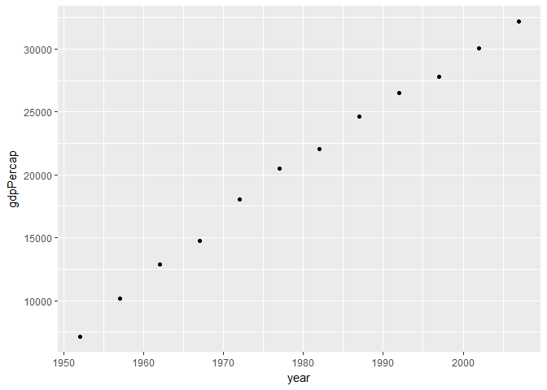
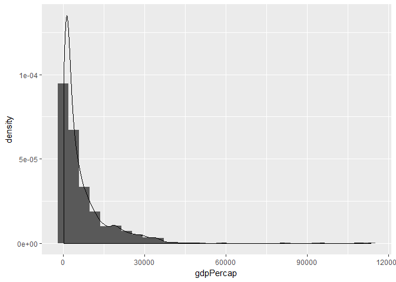

hw02-gapminder
================

Exploration of the gapminder data set
=====================================

Initialize the data
-------------------

-   Load the gapminder and tidyverse libraries:

``` r
library(gapminder)
library(tidyverse)
```

    ## -- Attaching packages ---------------------------------------------------------------------------------------------------------- tidyverse 1.2.1 --

    ## v ggplot2 2.2.1     v purrr   0.2.5
    ## v tibble  1.4.2     v dplyr   0.7.4
    ## v tidyr   0.8.1     v stringr 1.3.0
    ## v readr   1.1.1     v forcats 0.3.0

    ## -- Conflicts ------------------------------------------------------------------------------------------------------------- tidyverse_conflicts() --
    ## x dplyr::filter() masks stats::filter()
    ## x dplyr::lag()    masks stats::lag()

Explore the data
----------------

-   Scope the data types and sizes:

``` r
(typeof(gapminder))
```

    ## [1] "list"

``` r
(str(gapminder))
```

    ## Classes 'tbl_df', 'tbl' and 'data.frame':    1704 obs. of  6 variables:
    ##  $ country  : Factor w/ 142 levels "Afghanistan",..: 1 1 1 1 1 1 1 1 1 1 ...
    ##  $ continent: Factor w/ 5 levels "Africa","Americas",..: 3 3 3 3 3 3 3 3 3 3 ...
    ##  $ year     : int  1952 1957 1962 1967 1972 1977 1982 1987 1992 1997 ...
    ##  $ lifeExp  : num  28.8 30.3 32 34 36.1 ...
    ##  $ pop      : int  8425333 9240934 10267083 11537966 13079460 14880372 12881816 13867957 16317921 22227415 ...
    ##  $ gdpPercap: num  779 821 853 836 740 ...

    ## NULL

``` r
class(gapminder)
```

    ## [1] "tbl_df"     "tbl"        "data.frame"

``` r
nrow(gapminder)
```

    ## [1] 1704

``` r
ncol(gapminder)
```

    ## [1] 6

``` r
length(gapminder)
```

    ## [1] 6

``` r
head(gapminder)
```

    ## # A tibble: 6 x 6
    ##   country     continent  year lifeExp      pop gdpPercap
    ##   <fct>       <fct>     <int>   <dbl>    <int>     <dbl>
    ## 1 Afghanistan Asia       1952    28.8  8425333      779.
    ## 2 Afghanistan Asia       1957    30.3  9240934      821.
    ## 3 Afghanistan Asia       1962    32.0 10267083      853.
    ## 4 Afghanistan Asia       1967    34.0 11537966      836.
    ## 5 Afghanistan Asia       1972    36.1 13079460      740.
    ## 6 Afghanistan Asia       1977    38.4 14880372      786.

``` r
summary(gapminder)
```

    ##         country        continent        year         lifeExp     
    ##  Afghanistan:  12   Africa  :624   Min.   :1952   Min.   :23.60  
    ##  Albania    :  12   Americas:300   1st Qu.:1966   1st Qu.:48.20  
    ##  Algeria    :  12   Asia    :396   Median :1980   Median :60.71  
    ##  Angola     :  12   Europe  :360   Mean   :1980   Mean   :59.47  
    ##  Argentina  :  12   Oceania : 24   3rd Qu.:1993   3rd Qu.:70.85  
    ##  Australia  :  12                  Max.   :2007   Max.   :82.60  
    ##  (Other)    :1632                                                
    ##       pop              gdpPercap       
    ##  Min.   :6.001e+04   Min.   :   241.2  
    ##  1st Qu.:2.794e+06   1st Qu.:  1202.1  
    ##  Median :7.024e+06   Median :  3531.8  
    ##  Mean   :2.960e+07   Mean   :  7215.3  
    ##  3rd Qu.:1.959e+07   3rd Qu.:  9325.5  
    ##  Max.   :1.319e+09   Max.   :113523.1  
    ## 

### Conclusions:

-   Type: list (using typeof())
-   Rows:1704; Columns:6
-   Gapminder contains the classes: tbl\_df (i.e. tibble), tbl (i.e. table) and df (i.e. data frame)
-   Variable types:

| **Variable** | **Type**              |
|--------------|-----------------------|
| country      | factor w/ 142 levels: |
| continent    | factor w/ 5 levels    |
| year         | int                   |
| lifeExp      | num                   |
| pop          | int                   |
| gpdPercap    | num                   |

-   There are multiple ways to determine the size and extent of data (e.g. str, typeof, head, summary). Multiple ways assessing the data can be useful for error checking based on expected redundancies (e.g. str() provides information that is redundant with the information obtained from ncol() and nrow())

Explore the variables
---------------------

-   The categorical variable *continent* and the quantitative variable *gdpPercap* are selected. The range of each is determined below:

``` r
(range(gapminder$gdpPercap))
```

    ## [1]    241.1659 113523.1329

``` r
(levels(gapminder$continent))
```

    ## [1] "Africa"   "Americas" "Asia"     "Europe"   "Oceania"

-   The spread and distribution of *gdpPercap* is explored below; The function var() versus variance calculated using a manual method is used to error check

``` r
gdp <- select(gapminder, gdpPercap)
n <- nrow(gdp)
(mu <- sum(gdp)/n)
```

    ## [1] 7215.327

``` r
diffs <- gdp - mu
variance <- sum(diffs^2) / (n-1)
variance
```

    ## [1] 97169410

``` r
(var(gdp))
```

    ##           gdpPercap
    ## gdpPercap  97169410

-   The box plot and violin plot are used to explore the shape of the data

``` r
ggplot(gapminder, aes(continent, gdpPercap)) +
  geom_boxplot()
```


``` r
ggplot(gapminder, aes(continent, gdpPercap)) +
  geom_violin()
```


### Conclusions

-   The mean of gdpperCap is 7215.327
-   The variance of gdpPercap is 97169410
-   The box plot and violin plot are both graphical interpretations of the distribution

Using filter(), select() and %&gt;% to explore various plot types
-----------------------------------------------------------------

-   Filter() and select() are used to identify a subset of the data based on specific criteria
-   Scatterplots are useful for making observation about data; trend line can also be added
-   The scatterplot below shows the GDP per capita over time in Germany:

``` r
gapminder %>% 
  select(year, gdpPercap, country) %>% 
  filter(country == "Germany") %>% 
  ggplot(aes(year, gdpPercap)) +
    geom_point()
```



-   Histograms are useful for determining the distribution of data (e.g. Gaussian, bimodal):

``` r
ggplot(gapminder, aes(gdpPercap)) +
  geom_histogram(aes(y=..density..)) +
  geom_density()
```

    ## `stat_bin()` using `bins = 30`. Pick better value with `binwidth`.



-   Faceting is useful for illustrating data for several different factors (e.g. GDP per capita over time for each continent):

``` r
ggplot(gapminder, aes(year, gdpPercap)) +
  facet_wrap( ~ continent, scale = "free_x") +
  geom_point()
```


### Conclusions

-   Many types of plots can be used to explore data trends and distributions using R
-   The data can be broken down into subsets using functions like filter() and select() to make it more manageable
-   Piping is a convenient way to feed a variable into a plot or function
